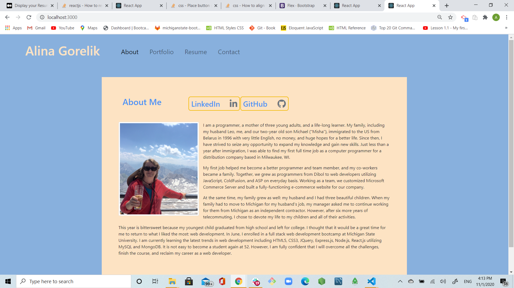
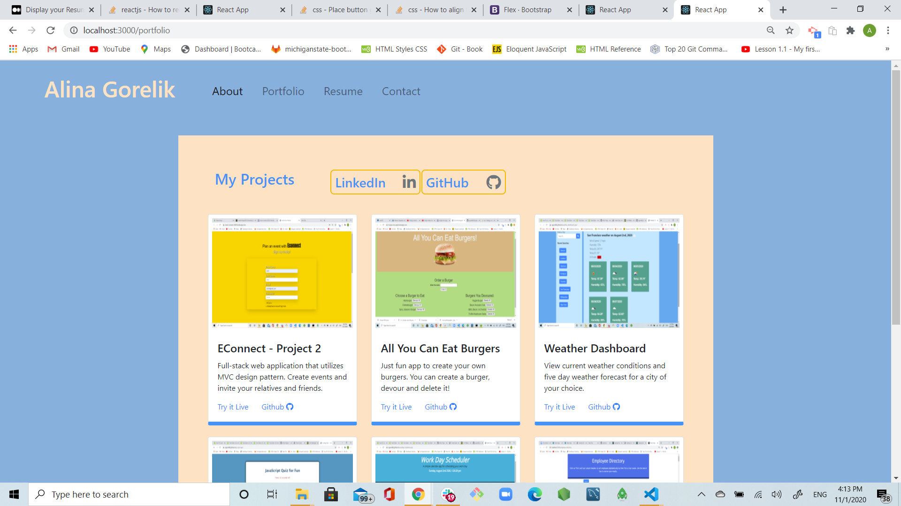
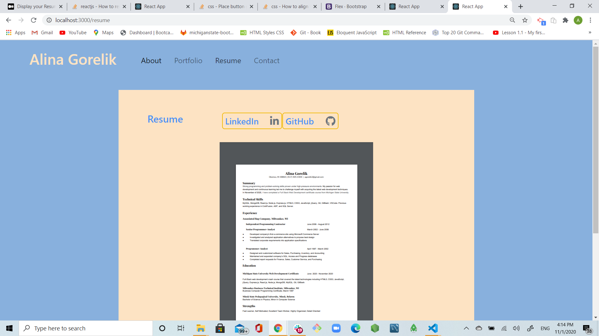
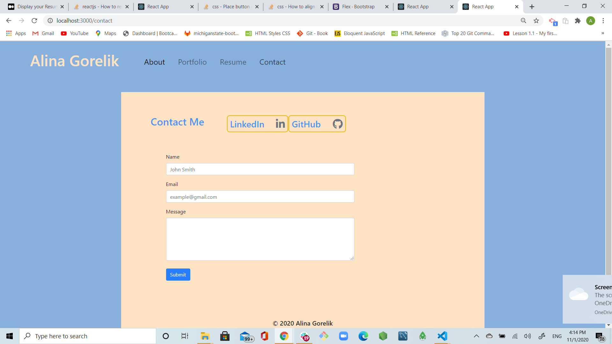

# alina-portfolio-react

## Username:

agorelik2

## Title:

### Alina Portfolio React

[Link to the deployed application](https://agorelik2.github.io/employee-directory/)

## Table of Content

- [Description](#description)
- [Updated Portfolio](#updated-portfolio)
- [Screen Shots](#screen-shots)
- [React](#react)
- [Development](#development)
- [Design](#design)
- [Installation](#installation)
- [Dependencies](#dependencies)
- [Built With](#built-with)
- [Repo](#repo)
- [Demo](#demo)
- [Developer](#developer)

## Description

This application is a project portfolio built with React.

## Updated Portfolio

My updated portfolio site still has all of the content it previously had:

- My name, About, Portfolio, Resume and Contact pages

- Links to my GitHub profile & LinkedIn page

- A link to a PDF of my resume with updated projects

- A list of projects. For each project, I have the following:

  - Project title

  - Link to the deployed version

  - Link to the GitHub repository

  - GIF or screenshot of the deployed application

## Screen Shots

The home page is called About Me. It will also display if "Alina Gorelik" link is clicked on.

Portfolio page displays 6 projects, links to my Github and LinkedIn

Resume page

Contact Me page

## React

The pre-existing alina-portfolio application was completely refactored into REACT application.

- The App.js file was created to handle the routing in the application using "react-router-dom" npm package
- The following page components got created:
  - About.js
  - Contact.js
  - Portfolio.js
  - Resume.js
- The following functional components are created to be used on multople pages:
  - Header.js
  - NavBar.js
  - SocMedia.js
  - Footer.js
- New Project.js component is created to be used on Porfolio page to display every single project
- New Utils folder has projects.json file that contains data being imported into Portfolio page
- New Images folder contains all the _.png and _.pdf files used by the application
- App.css file was modified to hold all the custom styles for the application
- Package.json file was updated as required for the app deployment
- Public/index.html was updated to have a script enabling fontawesome

## Development

- Updated portfolio featuring 6 total projects

- Used React to refactor the exisiting alina-portfolio app

- Added `Header` component that appears on multiple pages

- Created a single `Project` component that will be used multiple times on Portfolio page

- Created navigation using React Router, dynamic rendering the pages

- Added `Footer` component that appears on multiple pages

- Updated GitHub profile with pinned repositories featuring those same projects

- Deployed this site to GitHub Pages using the [Create React App docs for deployment.](https://create-react-app.dev/docs/deployment/#github-pages)

#### Design

- Mobile-first design

- Chose a color palette for your site so it doesn't just look like
  the default bootstrap theme or an unstyled HTML site.

- Made sure the font size is large enough to read, and that the colors don't cause eye strain.

## Installation

To use this application locally:

- Install Node.js on your computer
- Create Github Repo for the app, and clone it on your local machine
- Run `npx create-react-app .` to create boilerplate react application
- Use `npm install` to install all the dependencies, see [Dependencies](#dependencies) for the complete list
- Run `npm start`

## Dependencies

    "@testing-library/jest-dom": "^5.11.5",
    "@testing-library/react": "^11.1.0",
    "@testing-library/user-event": "^12.1.10",
    "bootstrap": "^4.5.3",
    "react": "^17.0.1",
    "react-dom": "^17.0.1",
    "react-router-dom": "^5.2.0",
    "react-scripts": "4.0.0",
    "web-vitals": "^0.2.4"

## Built With

- [VScode](https://code.visualstudio.com/)
- [Gitbash](https://gitforwindows.org/)
- [node.js](https://nodejs.org/en/)
- [express.js](https://expressjs.com/)
- [react.js](https://reactjs.org/)

## Repo:

https://github.com/agorelik2/alina-portfolio-react

## Demo:

https://agorelik2.github.io/employee-directory/

## Developer

    Alina Gorelik
